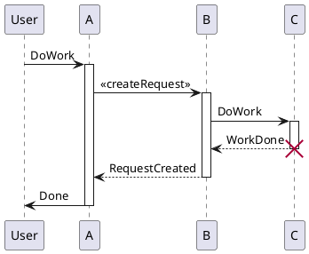

# 1 参考
http://www.woshipm.com/pd/5116059.html
http://www.woshipm.com/data-analysis/4420955.html


# 2 关键字
#UML/时序图

# 3 概述

## 3.1 什么是时序图?
时序图,通常被开发者用来对一个场景下的对象交互建模. 它解释了一个系统中的不同部件之间,彼此是通过怎样的交互来实现的某个功能, 以及特定场景下交互发生的顺序。

简而言之,时序图展示了系统的不同部件的执行序列。

## 3.2 序列图的目的
-   模拟系统中活动对象之间的高级交互
-   对实现用例的协作中的**对象实例**之间的交互建模
-   对实现操作的协作中的对象之间的交互建模
-   模拟通用交互（显示通过交互的所有可能路径）或交互的特定实例（仅显示交互中的一条路径）

## 3.3 序列图一览
序列图显示元素随着时间的推移而相互作用，它们根据对象（水平）和时间（垂直）组织：

对象维度

横轴表示交互中涉及的元素
传统上，操作中涉及的对象根据它们何时参与消息序列从左到右列出。但是，横轴上的元素可以按任何顺序出现
时间维度

纵轴表示页面下的时间进程（或进展）。
注意：

序列图中的时间都是关于排序的，而不是持续时间。交互图中的垂直空间与交互持续时间无关。

## 3.4 时序图符号
一个时序图是通过,一个时间线从顶部逐步下降的方式,去标记交互的时序. 每个对象对应一个列,它们之间的消息传递通过箭头表示.

时序图的各部件的快速概览

### 3.4.1 生命线(lifeline)


时序图由这些生命线构成,它们应该水平排列的,两个生命线批次不应该重叠. 它们代表了系统中产生交互的对象或部件.

A lifeline notation with an actor element symbol is used when the particular sequence diagram is owned by a use case.


带有实体(Entity)元素的生命线表示系统数据. 作为例子,在顾客服务应用中,顾客实体将管理所有与顾客相关的数据


带有边界(boundary)元素的生命线表示一个系统的边界,或者系统中的一个软件元素. 作为例子,与用户交互的接口界面,数据库网关,或者菜单,就是边界.


带有控制(Control)元素的生命线表示以一个控制实体或管理者. 它组织和调度在边界(boundary)和实体(entities)间的交互,并作为两者之间的中介者.


### 3.4.2 激活条(Activation Bars)

激活条是被放在生命线上的一个矩形. 它被用来指示一个对象正在与其他对象交互,处于活跃的(或实例化的)状态. 这个矩形的长度表明对象处于激活状态的持续时间.

在时序图中,两个对象间的交互发生在其中给一个发送消息给另一个时. 发送消息的对象和接受消息的对象的生命线上的激活条,表明两者在传递消息期间处于激活(或实例化)状态.


### 3.4.3 消息箭头(Message Arrows)

从消息发送者到消息接收者的箭头用于表明一个消息. 一个消息箭头可以是任何方向,从左到右,从右到左,或者指向消息发送者本身. 你可以在消息箭头上描述要从一方发送到另一方的消息,通过不同的箭头形状,你可以指示要被发送或接受的消息的类型.

消息箭头带有一个被称为消息签名(message signature)的描述(description)在上面, 消息签名的格式如下,除了 `message_name`之外都是可选的.

```text
attribute = message_name (arguments): return_type
```

-   同步消息

如果发送方(在继续下一个消息前)等待接受方去处理消息并返回,称为同步消息. 其用于指明消息的类型的箭头是实心的,像下面这样:


-   异步消息

如果消息的传送是异步的,使用下面这种箭头:


-   返回消息(return message)

一个返回消息被用来指示消息接收者已经完成的消息处理,并返回控制权给发送方. 返回消息是可选的,一个激活条被同步消息触发,就默认有一个返回消息.

提示: 为了避免弄乱你的时序图,你可以减少使用返回消息,因为返回消息可以被在发送方的消息箭头上描述.


-   创建消息(creation message)

一个对象并不一定在整个时序图的持续期间都存活,所以不必在一开始就创建它们,而是可以在必要时(它们接受消息时)创建.


-   销毁消息(destruction message)

同样地,当一个对象不被需要时,也可以将它从时序图中删除.通过添加一个'X'在生命线末端表示删除一个对象.


-   反身消息(Reflexive message)

当一个对象发送消息给自身时,它发起了一个反身消息, 通过一个消息箭头从生命线发起和接收,来表示.


### 3.4.4 注释

所有类型的UML图通常都允许评论注释. 评论符号是一个折角的矩形,像下面这样,可以用虚线连接到相关的对象.


# 4 例子


# 5 使用
https://plantuml.com/zh/sequence-diagram
https://blog.csdn.net/chktsang/article/details/88818627
## 5.1 生命线的激活与撤销
关键字`activate`和`deactivate`用来表示参与者的生命活动。

一旦参与者被激活，它的生命线就会显示出来。

`activate`和`deactivate`适用于以上情形。

`destroy`表示一个参与者的生命线的终结。


