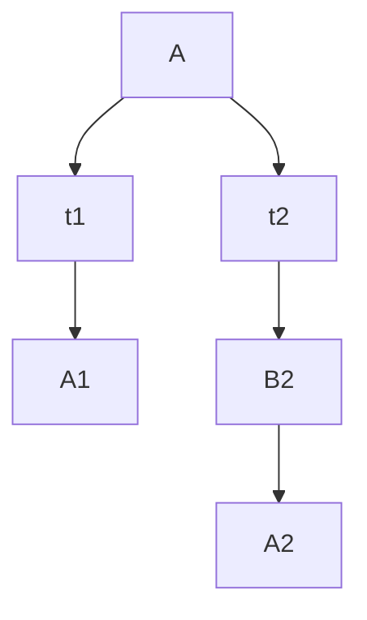

# 什么是CAS

 CAS，Compare and Swap即比较并交换。 java.util.concurrent包借助CAS实现了区别于synchronized同步锁的一种乐观锁。乐观锁就是每次去取数据的时候都乐观的认为数据不会被修改，所以不会上锁，但是在更新的时候会判断一下在此期间数据有没有更新。**CAS有3个操作数：内存值V，旧的预期值A，要修改的新值B**。当且仅当预期值A和内存值V相同时，将内存值V修改为B，否则什么都不做。CAS的关键点在于，**系统在硬件层面保证了比较并交换操作的原子性**，处理器使用基于对缓存加锁或总线加锁的方式来实现多处理器之间的原子操作。


## CAS开销
前面说过了，CAS（比较并交换）是CPU指令级的操作，只有一步原子操作，所以非常快。而且CAS避免了请求操作系统来裁定锁的问题，不用麻烦操作系统，直接在CPU内部就搞定了。但CAS就没有开销了吗？不！有cache miss的情况。这个问题比较复杂，首先需要了解CPU的硬件体系结构：


上图可以看到一个8核CPU计算机系统，每个CPU有cache（CPU内部的高速缓存，寄存器），管芯内还带有一个互联模块，使管芯内的两个核可以互相通信。在图中央的系统互联模块可以让四个管芯相互通信，并且将管芯与主存连接起来。数据以“缓存线”为单位在系统中传输，“缓存线”对应于内存中一个 2 的幂大小的字节块，大小通常为 32 到 256 字节之间。当 CPU 从内存中读取一个变量到它的寄存器中时，必须首先将包含了该变量的缓存线读取到 CPU 高速缓存。同样地，CPU 将寄存器中的一个值存储到内存时，不仅必须将包含了该值的缓存线读到 CPU 高速缓存，还必须确保没有其他 CPU 拥有该缓存线的拷贝。

比如，如果 CPU0 在对一个变量执行“比较并交换”（CAS）操作，而该变量所在的缓存线在 CPU7 的高速缓存中，就会发生以下经过简化的事件序列：

- CPU0 检查本地高速缓存，没有找到缓存线。

- 请求被转发到 CPU0 和 CPU1 的互联模块，检查 CPU1 的本地高速缓存，没有找到缓存线。

- 请求被转发到系统互联模块，检查其他三个管芯，得知缓存线被 CPU6和 CPU7 所在的管芯持有。

- 请求被转发到 CPU6 和 CPU7 的互联模块，检查这两个 CPU 的高速缓存，在 CPU7 的高速缓存中找到缓存线。

- CPU7 将缓存线发送给所属的互联模块，并且刷新自己高速缓存中的缓存线。

- CPU6 和 CPU7 的互联模块将缓存线发送给系统互联模块。

- 系统互联模块将缓存线发送给 CPU0 和 CPU1 的互联模块。

- CPU0 和 CPU1 的互联模块将缓存线发送给 CPU0 的高速缓存。

- CPU0 现在可以对高速缓存中的变量执行 CAS 操作了

  
以上是**刷新不同CPU缓存的开销**。最好情况下的 CAS 操作消耗大概 40 纳秒，超过 60 个时钟周期。这里的“最好情况”是指对某一个变量执行 CAS 操作的 CPU 正好是最后一个操作该变量的CPU，所以对应的缓存线已经在 CPU 的高速缓存中了，类似地，最好情况下的锁操作（一个“round trip 对”包括获取锁和随后的释放锁）消耗超过 60 纳秒，超过 100 个时钟周期。这里的“最好情况”意味着用于表示锁的数据结构已经在获取和释放锁的 CPU 所属的高速缓存中了。锁操作比 CAS 操作更加耗时，是因深入理解并行编程 
为锁操作的数据结构中需要两个原子操作。缓存未命中消耗大概 140 纳秒，超过 200 个时钟周期。需要在存储新值时查询变量的旧值的 CAS 操作，消耗大概 300 纳秒，超过 500 个时钟周期。想想这个，在执行一次 CAS 操作的时间里，CPU 可以执行 500 条普通指令。这表明了细粒度锁的局限性。

以下是cache miss cas 和lock的性能对比：


# CAS的优缺点
- CAS由于是在**硬件层面保证的原子性**，不会锁住当前线程，它的效率是很高的。
- CAS虽然很高效的实现了原子操作，但是它依然存在三个问题。

1、**ABA问题**。CAS在操作值的时候检查值是否已经变化，没有变化的情况下才会进行更新。但是如果一个值原来是A，变成B，又变成A，那么CAS进行检查时会认为这个值没有变化，但是实际上却变化了。ABA问题的解决方法是使用版本号。在变量前面追加上版本号，每次变量更新的时候把版本号加一，那么A－B－A 就变成1A-2B－3A。从Java1.5开始JDK的atomic包里提供了一个类AtomicStampedReference来解决ABA问题。

2、**并发越高，失败的次数会越多**，CAS如果长时间不成功，会极大的增加CPU的开销。因此CAS不适合竞争十分频繁的场景。

3、**只能保证一个共享变量的原子操作**。当对多个共享变量操作时，CAS就无法保证操作的原子性，这时就可以用锁，或者把多个共享变量合并成一个共享变量来操作。比如有两个共享变量i＝2,j=a，合并一下ij=2a，然后用CAS来操作ij。从Java1.5开始JDK提供了**AtomicReference类来保证引用对象的原子性**，你可以把多个变量放在一个对象里来进行CAS操作。

## ABA

### 什么是ABA问题？

假设现在主内存中的值是A，现有t1和t2两个线程去对其进行操作。t1和t2先将A拷贝回自己的工作内存。这个时候t2线程将A改成B，刷回到主内存。此刻主内存和t2的工作内存中的值都是B。接下来还是t2线程抢到执行权，t2又把B改回A，并刷回到主内存。这时t1终于抢到执行权了，自己工作内存中的值的A，主内存也是A，因此它认为没人修改过，就在工作内存中把A改成了X，然后刷回主内存。也就是说，在t1线程执行前，t2将主内存中的值由A改成B再改回A。这便是ABA问题。看下面的代码演示(代码涉及到原子引用，请参考下面的原子引用的介绍)：




```
class ABADemo {
   static AtomicReference<String> atomicReference = new AtomicReference<>("A");
   public static void main(String[] args){
          new Thread(() -> {
              atomicReference.compareAndSet("A","B");
              atomicReference.compareAndSet("B","A");
              },"t2").start();
          new Thread(() -> {
              try { 
                   TimeUnit.SECONDS.sleep(1);
              } catch (InterruptedException e) {
                   e.printStackTrace(); 
              }
              System.out.println(atomicReference.compareAndSet("A","C") 
                                           + "\t" + atomicReference.get());
              },"t1").start();
   }
}
```

这段代码执行结果是"true C"，这就证明了ABA问题的存在。**如果一个业务只管开头和结果，不管这个A中间是否变过，那么出现了ABA问题也没事。如果需要A还是最开始的那个A，中间不许别人动手脚，那么就要规避ABA问题**。要解决ABA问题，先看下面的原子引用的介绍。

### 原子引用
JUC包下给我们提供了原子包装类，像AtomicInteger。如果我不仅仅想要原子包装类，我自己定义的User类也想具有原子操作，怎么办呢？JUC为我们提供了AtomicReference<>，即原子引用。看下面的代码：

```java
@AllArgsConstructor
class User {
    int age;
    String name;

    public static void main(String[] args){
        User user = new User(20,"张三");
        AtomicReference<User> atomicReference = new AtomicReference<>();
        atomicReference.set(user);
    }
}
```


### 解决ABA问题思路

#### 带时间戳的原子引用(AtomicStampedReference)

```
class ABADemo {
        static AtomicStampedReference<String> atomicReference = new AtomicStampedReference<>("A", 1);
        public static void main(String[] args) {
            new Thread(() -> {
                try {
                    TimeUnit.SECONDS.sleep(1);// 睡一秒，让t1线程拿到最初的版本号
                } catch (InterruptedException e) {
                    e.printStackTrace();
                }
                atomicReference.compareAndSet("A", "B", atomicReference.getStamp(), atomicReference.getStamp() + 1);
                atomicReference.compareAndSet("B", "A", atomicReference.getStamp(), atomicReference.getStamp() + 1);
            }, "t2").start();
            new Thread(() -> {
                int stamp = atomicReference.getStamp();//拿到最开始的版本号
                try {
                    TimeUnit.SECONDS.sleep(3);// 睡3秒，让t2线程的ABA操作执行完
                } catch (InterruptedException e) {
                    e.printStackTrace();
                }
                System.out.println(atomicReference.compareAndSet("A", "C", stamp, stamp + 1));
            }, "t1").start();
        }
}
```

初始版本号为1，t2线程每执行一次版本号加。等t1线程执行的时候，发现当前版本号不是自己一开始拿到的1了，所以set失败，输出false。这就解决了ABA问题。


## 循环时间长，开销大
synchronized是加锁，同一时间只能一个线程访问，并发性不好。而CAS并发性提高了，但是由于CAS存在自旋操作，即do while循环，如果CAS失败，会一直进行尝试。如果CAS长时间不成功，会给CPU带来很大的开销。


## 只能保证一个共享变量的原子性
上面也看到了，getAndAddInt方法的val1是代表当前对象，所以它也就是能保证这一个共享变量的原子性。如果要保证多个，那只能加锁了。

	

## 乐观锁
乐观锁的思想与悲观锁的思想相反，它总认为资源和数据不会被别人所修改，所以读取不会上锁，但是乐观锁在进行写入操作的时候会判断当前数据是否被修改过(具体如何判断我们下面再说)。乐观锁的实现方案一般来说有两种： `版本号机制` 和 `CAS实现` 。乐观锁多适用于多度的应用类型，这样可以提高吞吐量。

在Java中`java.util.concurrent.atomic`包下面的原子变量类就是使用了乐观锁的一种实现方式CAS实现的。


### 版本号机制
版本号机制是在数据表中加上一个 `version` 字段来实现的，表示数据被修改的次数，当执行写操作并且写入成功后，version = version + 1，当线程A要更新数据时，在读取数据的同时也会读取 version 值，在提交更新时，若刚才读取到的 version 值为当前数据库中的version值相等时才更新，否则重试更新操作，直到更新成功。

我们以上面的金融系统为例，来简述一下这个过程。


成本系统中有一个数据表，表中有两个字段分别是`金额`和`version`，金额的属性是能够实时变化，而 version 表示的是金额每次发生变化的版本，一般的策略是，当金额发生改变时，version 采用递增的策略每次都在上一个版本号的基础上 + 1。

- 在了解了基本情况和基本信息之后，我们来看一下这个过程：公司收到回款后，需要把这笔钱放在金库中，假如金库中存有100 元钱

- - 下面开启事务一：当男柜员执行回款写入操作前，他会先查看(读)一下金库中还有多少钱，此时读到金库中有 100 元，可以执行写操作，并把数据库中的钱更新为 120 元，提交事务，金库中的钱由 100 -> 120，version的版本号由 0 -> 1。
  - 开启事务二：女柜员收到给员工发工资的请求后，需要先执行读请求，查看金库中的钱还有多少，此时的版本号是多少，然后从金库中取出员工的工资进行发放，提交事务，成功后版本 + 1，此时版本由 1 -> 2。

**上面两种情况是最乐观的情况，上面的两个事务都是顺序执行的，也就是事务一和事务二互不干扰，那么事务要并行执行会如何呢？**


事务一开启，男柜员先执行读操作，取出金额和版本号，执行写操作

```mysql
begin
update 表 set 金额 = 120,version = version + 1 where 金额 = 100 and version = 0
```

此时金额改为 120，版本号为1，事务还没有提交

事务二开启，女柜员先执行读操作，取出金额和版本号，执行写操作

```mysql
begin
update 表 set 金额 = 50,version = version + 1 where 金额 = 100 and version = 0
```

此时金额改为 50，版本号变为 1，事务未提交

现在提交事务一，金额改为 120，版本变为1，提交事务。理想情况下应该变为 金额 = 50，版本号 = 2，但是实际上事务二 的更新是建立在金额为 100 和 版本号为 0 的基础上的，所以事务二不会提交成功，应该重新读取金额和版本号，再次进行写操作。

这样，就避免了女柜员 用基于 version=0 的旧数据修改的结果覆盖男操作员操作结果的可能


## 悲观锁
`悲观锁`是一种悲观思想，它总认为最坏的情况可能会出现，它认为数据很可能会被其他人所修改，所以悲观锁在持有数据的时候总会把`资源` 或者 `数据` 锁住，这样其他线程想要请求这个资源的时候就会阻塞，直到等到悲观锁把资源释放为止。传统的关系型数据库里边就用到了很多这种锁机制，**比如行锁，表锁等，读锁，写锁等，都是在做操作之前先上锁。** 悲观锁的实现往往依靠数据库本身的锁功能实现。


Java 中的 `Synchronized` 和 `ReentrantLock` 等独占锁(排他锁)也是一种悲观锁思想的实现，因为 Synchronzied 和 ReetrantLock 不管是否持有资源，它都会尝试去加锁，生怕自己心爱的宝贝被别人拿走。


## CAS与synchronized的使用情景
简单的来说 CAS 适用于写比较少的情况下（多读场景，冲突一般较少），synchronized 适用于写比较多的情况下（多写场景，冲突一般较多）

- 对于资源竞争较少（线程冲突较轻）的情况，使用 synchronized 同步锁进行线程阻塞和唤醒切换以及用户态内核态间的切换操作额外浪费消耗 cpu 资源；而 CAS 基于硬件实现，不需要进入内核，不需要切换线程，操作自旋几率较少，因此可以获得更高的性能。
- 对于资源竞争严重（线程冲突严重）的情况，CAS 自旋的概率会比较大，从而浪费更多的 CPU 资源，效率低于 synchronized。

> 补充： Java并发编程这个领域中 synchronized 关键字一直都是元老级的角色，很久之前很多人都会称它为 “重量级锁” 。但是，在JavaSE 1.6之后进行了主要包括为了减少获得锁和释放锁带来的性能消耗而引入的 偏向锁 和 轻量级锁 以及其它各种优化之后变得在某些情况下并不是那么重了。synchronized 的底层实现主要依靠 Lock-Free 的队列，基本思路是 自旋后阻塞，竞争切换后继续竞争锁，稍微牺牲了公平性，但获得了高吞吐量。在线程冲突较少的情况下，可以获得和 CAS 类似的性能；而线程冲突严重的情况下，性能远高于CAS。


## 总结
**<font color=red>读的多，冲突几率小，乐观锁</font>**。
**<font color=red>写的多，冲突几率大，悲观锁</font>**。


# 面试题

## 乐观锁加锁吗？

1、乐观锁**本身是不加锁**的，只是在更新时判断一下数据是否被其他线程更新了；AtomicInteger便是一个例子。

2、但是在**cpu层面保障原子性**是加锁的


## CAS有哪些缺点？

面试到这里，面试官可能已经中意你了。不过面试官准备对你发起最后的进攻：你知道CAS这种实现方式有什么缺点吗？

下面是CAS一些不那么完美的地方：

* 1、ABA问题

假设有两个线程——线程1和线程2，两个线程按照顺序进行以下操作：

(1)线程1读取内存中数据为A；

(2)线程2将该数据修改为B；

(3)线程2将该数据修改为A；

(4)线程1对数据进行CAS操作

在第(4)步中，由于内存中数据仍然为A，因此CAS操作成功，但实际上该数据已经被线程2修改过了。这就是ABA问题。

在AtomicInteger的例子中，ABA似乎没有什么危害。但是在某些场景下，ABA却会带来隐患，例如栈顶问题：一个栈的栈顶经过两次(或多次)变化又恢复了原值，但是栈可能已发生了变化。

对于ABA问题，比较有效的方案是引入版本号，内存中的值每发生一次变化，版本号都+1；在进行CAS操作时，不仅比较内存中的值，也会比较版本号，只有当二者都没有变化时，CAS才能执行成功。Java中的AtomicStampedReference类便是使用版本号来解决ABA问题的。


* 2、高竞争下的开销问题

在并发冲突概率大的高竞争环境下，如果CAS一直失败，会一直重试，CPU开销较大。针对这个问题的一个思路是引入退出机制，如重试次数超过一定阈值后失败退出。当然，更重要的是避免在高竞争环境下使用乐观锁。


* 3、功能限制

CAS的功能是比较受限的，例如CAS只能保证单个变量（或者说单个内存值）操作的原子性，这意味着：(1)原子性不一定能保证线程安全，例如在Java中需要与volatile配合来保证线程安全；(2)当涉及到多个变量(内存值)时，CAS也无能为力。

除此之外，CAS的实现需要硬件层面处理器的支持，在Java中普通用户无法直接使用，只能借助atomic包下的原子类使用，灵活性受到限制。


## 什么是CAS?  

------ 比较并交换，主内存值和工作内存值相同，就set为更新值。

## CAS原理是什么？

 ------ UnSafe类和自旋锁。理解那个do while循环。


## CAS缺点

### CAS缺点是什么？ ------ 循环时间长会消耗大量CPU资源；只能保证一个共享变量的原子性操作；造成ABA问题。

### 什么是ABA问题？ ------ t2线程先将A改成B，再改回A，此时t1线程以为没人修改过。

### 如何解决ABA问题？------ 使用带时间戳的原子引用。
